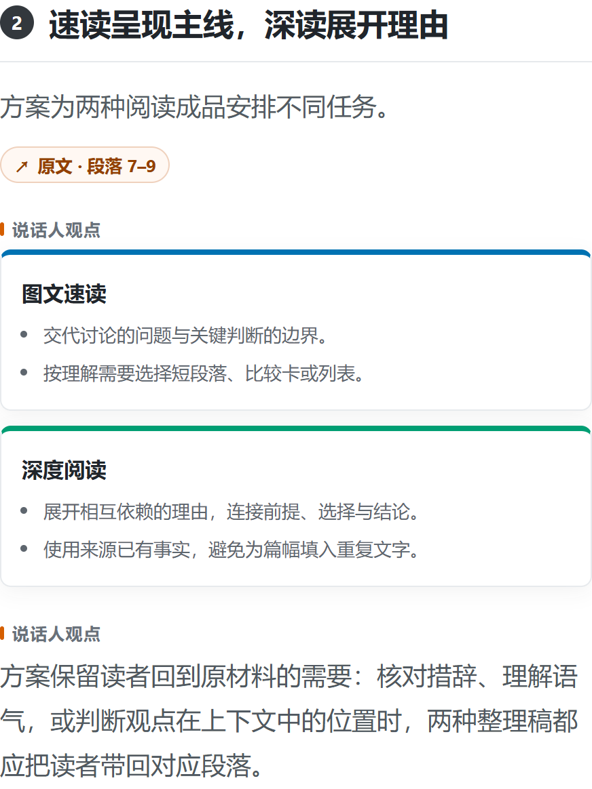
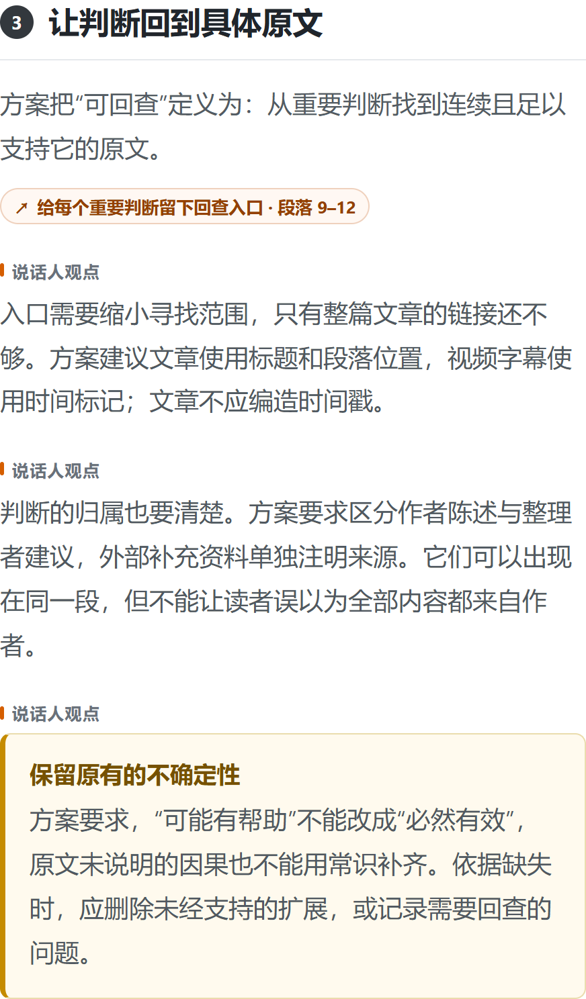

# 方法与原创成品节选

以下两张图来自随包原创演示文章[《把收藏变成一次可回查的阅读：一份演示方案》](../examples/reading-experiment.md)，由 AI 协助起草，用于验证整理与导出流程。它不是实际采访或阅读效率实验。速读成品预计阅读 3 分钟，按每分钟 450 字估算，与处理耗时不同。

## 一份材料，两种阅读成品

图文速读帮助了解主题与关键判断，深度阅读稿展开相互依赖的理由。这个真实生成的比较卡说明两者的任务，并保留原文段落定位入口。

## 从判断回到原文

重要判断应能找到连续且足以支持它的原文。下图展示段落回查入口，以及保留原文不确定性的提示。截图中的入口用于展示；在本地 HTML 成品中可以点击查看对应来源。

这是文章示例，使用段落定位，不使用视频时间戳。本演示没有人物背景、关键概念三行注释、外部引文或 QR-Pilot 编辑卡；这些模块可随材料及编辑需要提供。

## 已验证的不同材料类型

| 本地已完成案例 | 组织阅读的方式 | 原内容入口 |
| --- | --- | --- |
| 季逸超／Manus 访谈 | 梳理产品试错中的判断、理由与边界 | [原访谈](https://www.bilibili.com/video/BV1knvYBDEjs/) |
| Patrick Winston《How to Speak》讲座 | 梳理方法步骤，连接工具与练习 | [MIT OpenCourseWare](https://ocw.mit.edu/courses/res-tll-005-how-to-speak-january-iap-2018/pages/how-to-speak/) |
| 法国经济政策多人辩论 | 按议题比较不同发言者的主张与分歧 | [原视频](https://www.youtube.com/watch?v=VM8cGxOtUvA) |
| 康林松／奔驰专访 | 沿着目标、约束与选择理解产业决策 | [原访谈](https://www.bilibili.com/video/BV1zQL9z3ETw/) |

这里仅记录案例名称、整理方式和原链接，不附上述案例的截图、原字幕或完整稿，也不代表对所有内容类型的效果承诺。完整案例保留在作者的工作库。

## 开始自己的阅读

**图文速读**提供响应式 HTML、手机与桌面长图；**深度阅读稿**以 Markdown 展开推理与边界。需要核对时，可继续查看证据册和来源索引。

**QR-Pilot** 是 QuickRead 的 AI 阅读小编。速读中出现编辑点评时，会与嘉宾观点分开；深度阅读稿不含 QR-Pilot 编辑卡。

继续查看 [快速开始](getting-started.md)、[个性化指南](customization.md)、[素材与版权说明](content-use.md)。
